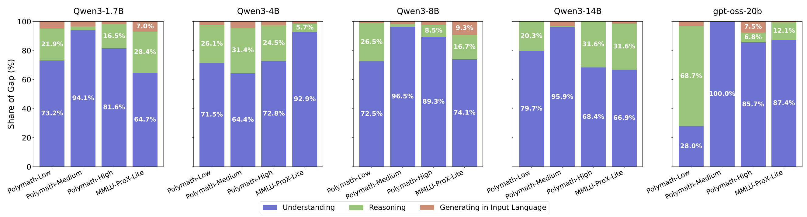

# Why Do Multilingual Reasoning Gaps Emerge in Reasoning Language Models?



This is the official repository for the paper:"Why Do Multilingual Reasoning Gaps Emerge in Reasoning Language Models?" by Deokhyung Kang, Seonjeong Hwang, Daehui Kim, Hyounghun Kim, and Gary Geunbae Lee  
[[arXiv:2510.27269](https://arxiv.org/abs/2510.27269)]

---

## Overview

This repository will contain the full implementation and resources for our paper.
All code, models, and datasets will be released by 12/20, 2025. Stay tuned! 🚀

---

## 📄 Citation

If you find this work useful, please cite our paper:

```bibtex
@misc{kang2025multilingualreasoninggapsemerge,
      title={Why Do Multilingual Reasoning Gaps Emerge in Reasoning Language Models?}, 
      author={Deokhyung Kang and Seonjeong Hwang and Daehui Kim and Hyounghun Kim and Gary Geunbae Lee},
      year={2025},
      eprint={2510.27269},
      archivePrefix={arXiv},
      primaryClass={cs.CL},
      url={https://arxiv.org/abs/2510.27269}, 
}
